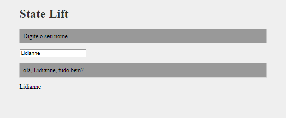

# HORA DE CODAR

## Índice

- [1. Sobre o projeto](#1-sobre-o-projeto)
- [2. Tecnologias Utilizadas](#2-tecnologias-utilizadas)

---
## 1. Sobre o projeto
 
Projeto desenvolvido para fixar conceitos de React na criação de componentes e uso do State Lift

State Lift - compartilhar o estato de um state para que cada componente faça o seu papel

Estamos centralizando o state nome no componente pai (PageStateLift) para que ele seja usado no componente 
filho (saudacao).

Estamos centralizando o setNome no componente pai (PageStateLift) para que ele seja usado no componente 
filho (SeuNome). 

## 2. Tecnologias utilizadas

- **HTML**
- **CSS**
- **Javascript**
- **React**
